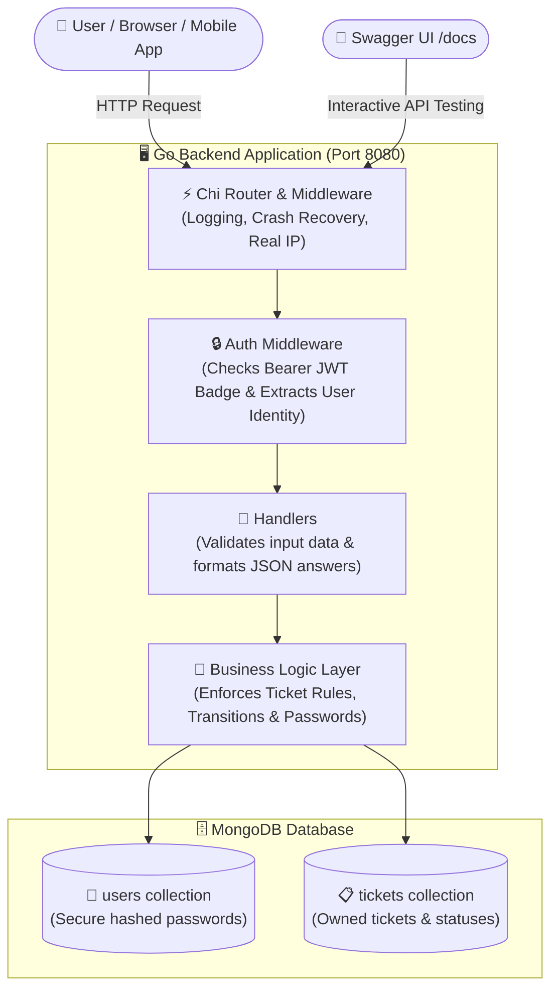
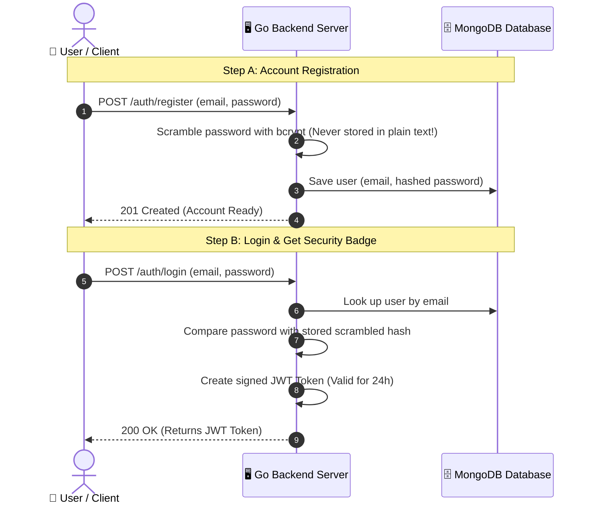
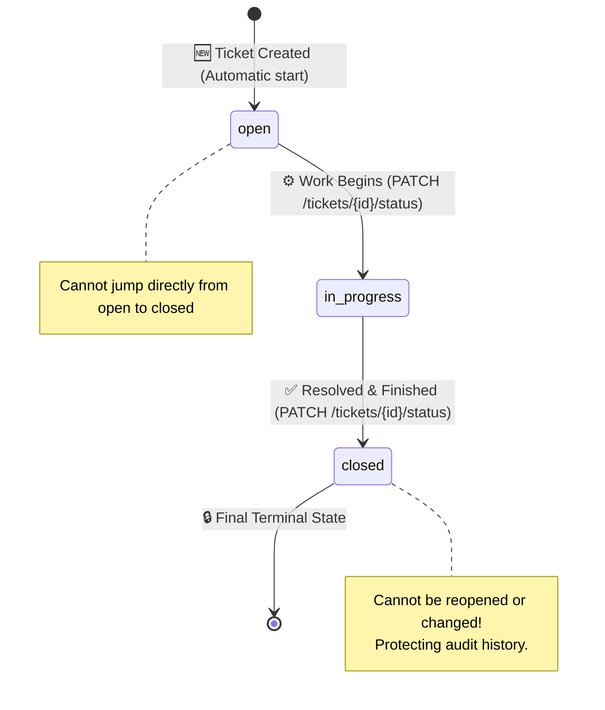
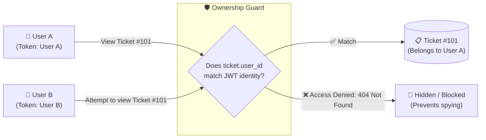

# 🎟️ Ticket System API

A reliable, secure, and production-grade support ticket management backend service built in **Go (Golang)** using the **Chi router**, **MongoDB**, **JWT authentication**, and interactive **Swagger/OpenAPI documentation**.

---

## 💡 What is this Project? (For Everyone & Non-Technical Readers)

Imagine you contact customer support when something goes wrong with a service. The support team creates a **Ticket** (a digital tracking record) describing your problem.

This backend project acts like the **secure digital office and filing system** for those tickets:
1. **User Accounts**: People can create their personal account and log in securely.
2. **Digital Security Pass (JWT Token)**: Once you log in, you receive a secure digital badge (like an electronic hotel keycard). You show this badge with every request so the system knows who you are.
3. **Private Filing Cabinet**: You can create tickets, view only your own tickets, and track their progress. Nobody else can peek at your tickets or edit them.
4. **Step-by-Step Progress Tracking**: Every ticket starts as **Open**, moves to **In Progress** while being worked on, and is finally marked **Closed**. Once closed, a ticket cannot be reopened.

---

## 🗺️ Visual Architecture & Workflow Diagrams

### 1. Overall System Architecture
How an incoming request travels from a user's browser or mobile app down to the database:



---

### 2. User Authentication & Login Flow
How a user signs up and gets their secure digital pass:



---

### 3. Ticket Lifecycle & State Machine
Every ticket follows a strictly controlled life cycle that prevents mistakes:



---

### 4. Strict Ownership & Privacy Flow
Why User A can never tamper with or view User B's tickets:



---

## 🌐 Public Deployment & Documentation URLs
- **Interactive Swagger Documentation**: `http://localhost:8080/docs` (or deployed: `https://<your-service>.onrender.com/docs`)
- **Public Health Check**: `http://localhost:8080/health` (or deployed: `https://<your-service>.onrender.com/health`)

---

## 📖 Interactive Swagger / OpenAPI Documentation

You don't need any complex software or programming tools to test this API! Simply open:

```text
http://localhost:8080/docs
```

The Swagger interface lets you:
- Explore all 7 endpoints and see their input and output structures.
- See sample data for every operation.
- Click **"Try it out"** and execute real requests directly from your web browser.
- Use the **Authorize** button to log in and test protected ticket features.

### Step-by-Step Swagger Testing Guide:
1. **Start the server**: Run `go run ./cmd/server` or start your Docker container.
2. **Open the page**: In your browser, navigate to `http://localhost:8080/docs`.
3. **Register an account**:
   - Expand `POST /auth/register`.
   - Click **Try it out**, enter your email and password, then click **Execute**.
4. **Log in**:
   - Expand `POST /auth/login`.
   - Click **Try it out**, enter your credentials, and click **Execute**.
   - Copy the long `token` string from the JSON response.
5. **Authorize Swagger**:
   - Scroll up and click the green **Authorize** button at the top right.
   - Enter `Bearer <paste_your_token_here>` and click **Authorize**, then **Close**.
6. **Manage Tickets**:
   - `POST /tickets`: Create a ticket with a title and description.
   - `GET /tickets`: View your ticket list.
   - `GET /tickets/{id}`: View details for one of your tickets.
   - `PATCH /tickets/{id}/status`: Change status from `open` to `in_progress`, then to `closed`.

---

## 📋 API Endpoint Reference

| Method | Endpoint | Requires Login? | Description |
| :--- | :--- | :---: | :--- |
| `GET` | `/health` | No | Instant health check verifying the server is running |
| `GET` | `/docs` | No | Interactive Swagger UI documentation page |
| `POST` | `/auth/register` | No | Create a new user account with secure password hashing |
| `POST` | `/auth/login` | No | Sign in and receive a signed JWT access pass |
| `POST` | `/tickets` | **Yes (Bearer JWT)** | Create a new support ticket (starts as `open`) |
| `GET` | `/tickets` | **Yes (Bearer JWT)** | List all tickets belonging to the logged-in user |
| `GET` | `/tickets/{id}` | **Yes (Bearer JWT)** | View a specific ticket belonging to the logged-in user |
| `PATCH`| `/tickets/{id}/status` | **Yes (Bearer JWT)** | Advance ticket status (`open -> in_progress -> closed`) |

---

## 🔒 Security Highlights (In Plain English)

1. **Passwords are Never Stored Plainly**: We use industry-standard **bcrypt** cryptography. Even if someone inspected the database directly, they would only see random scrambled text, never your real password.
2. **Tamper-Proof Identity**: When you create a ticket, you cannot pretend to be someone else. The server looks solely at your authenticated login badge (`JWT`) to record who owns the ticket.
3. **No Peeking (Privacy Isolation)**: If User A tries to view or modify User B's ticket ID, the server replies with `404 Not Found`. This prevents hackers from even guessing whether another user's ticket exists.
4. **Strict Status Lifecycle**: Statuses cannot jump randomly (e.g. from `open` straight to `closed`), and resolved (`closed`) tickets cannot be reopened.

---

## ⚙️ Environment Configuration

Configuration is loaded from environment variables or a local `.env` file (see `.env.example`):

| Variable | Default | Description |
| :--- | :--- | :--- |
| `PORT` | `8080` | Port on which the HTTP server listens (automatically set on cloud hosts like Render) |
| `MONGODB_URI` | `mongodb://localhost:27017` | MongoDB connection URL (use MongoDB Atlas for production) |
| `MONGODB_DATABASE` | `ticket_system` | Name of the database collection |
| `JWT_SECRET` | *(required in prod)* | Cryptographic key used to sign and verify login tokens |
| `JWT_EXPIRATION` | `24h` | Length of time a login token remains valid |

---

## 🐳 Docker Deployment

You can build and run the entire backend in an isolated container without needing Go installed on your machine.

### 1. Build the Docker Image
```bash
docker build -t ticket-system .
```

### 2. Run the Container
```bash
docker run -p 8080:8080 \
  -e MONGODB_URI="mongodb+srv://<user>:<password>@cluster.mongodb.net/?retryWrites=true&w=majority" \
  -e MONGODB_DATABASE="ticket_system" \
  -e JWT_SECRET="your_strong_secret_key" \
  -e JWT_EXPIRATION="24h" \
  ticket-system
```

### 3. Check Status
- Health: Visit `http://localhost:8080/health` (Returns `{"status":"ok"}`)
- Swagger: Visit `http://localhost:8080/docs` in any web browser

---

## 💻 Local Development (For Developers)

### Requirements
- **Go**: Version 1.22+ (tested with 1.24)
- **MongoDB**: Local instance running on port 27017 or a free cloud cluster on [MongoDB Atlas](https://www.mongodb.com/cloud/atlas)

### Start the Server
```bash
go run ./cmd/server
```

### Run Automated Tests
```bash
go test -v -count=1 ./...
```

---

## 🚀 Deploying to Cloud (AWS & Render)

### Option A: Deploy to AWS App Runner / ECS
1. **Container Registry (Amazon ECR)**:
   - Create a private repository in Amazon ECR (e.g. `ticket-system`).
   - Authenticate Docker and push the image:
     ```bash
     docker tag ticket-system:latest <aws_account_id>.dkr.ecr.<region>.amazonaws.com/ticket-system:latest
     docker push <aws_account_id>.dkr.ecr.<region>.amazonaws.com/ticket-system:latest
     ```
2. **Deploy Service**:
   - Go to **AWS App Runner** or **AWS ECS Fargate**.
   - Select the container image from ECR.
   - Configure Port: `8080`.
   - Configure Environment Variables: `MONGODB_URI`, `MONGODB_DATABASE`, `JWT_SECRET`, `JWT_EXPIRATION`.
   - Set Health Check Path: `/health`.

### Option B: Deploy on Render
1. **Push your code to GitHub**:
   ```bash
   git push origin main
   ```
2. **Create free MongoDB Database**:
   - Go to [MongoDB Atlas](https://www.mongodb.com/cloud/atlas) and set up a free cluster.
   - Whitelist IP `0.0.0.0/0` in Network Access.
   - Copy your connection string (`mongodb+srv://...`).
3. **Deploy on Render**:
   - In [Render Dashboard](https://dashboard.render.com), click **New + -> Web Service**.
   - Select your GitHub repository (`Ticket-System`).
   - Select **Docker** as the runtime environment.
   - Set the following environment variables:
     - `MONGODB_URI`: `<Your MongoDB Atlas connection URI>`
     - `MONGODB_DATABASE`: `ticket_system`
     - `JWT_SECRET`: `<A random secret string for JWT signing>`
     - `JWT_EXPIRATION`: `24h`
   - Click **Deploy**. Render will build the Docker container and provide a live public URL.
